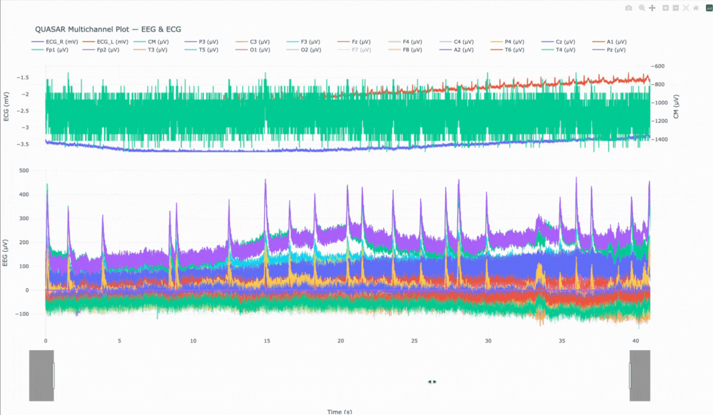
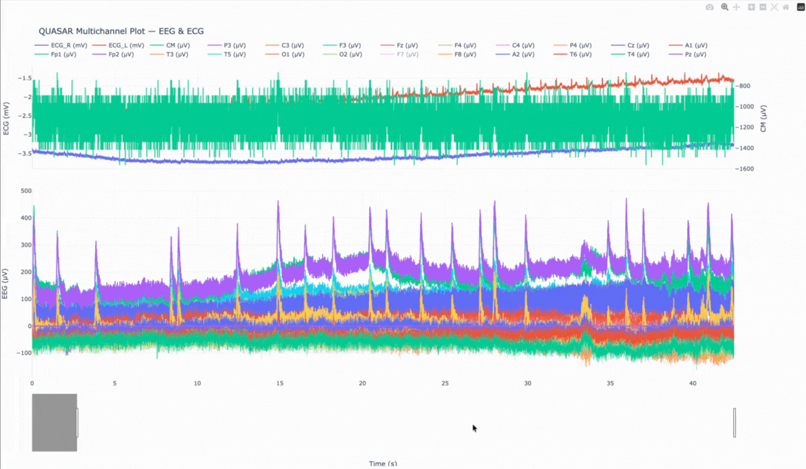
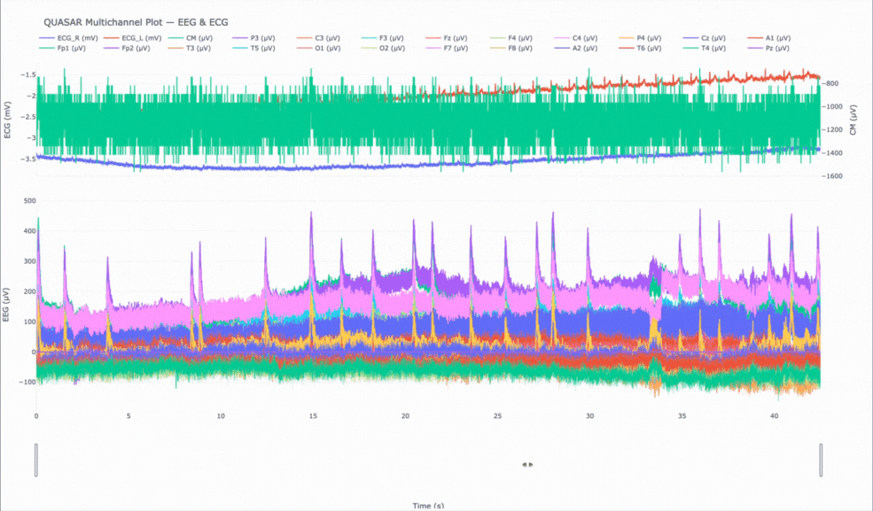

# QUASAR — Scrollable Multichannel Plot (EEG + ECG)

This repo contains a small, focused plotting **script** that loads the provided CSV (with `#` comment lines)
and produces an **interactive Plotly HTML** you can scroll, pan, zoom, and inspect. It renders EEG channels
(µV) alongside ECG channels (mV) with sensible scaling, and includes CM as a separate axis so its large
amplitude doesn’t drown out EEG.

## Quick Start

```bash
# 1) Create a virtual env (recommended)
python3 -m venv .venv && source .venv/bin/activate

# 2) Install deps
pip install -r requirements.txt

# 3) Generate the interactive HTML
python src/plot_signals.py --csv /path/to/EEG_and_ECG_data_02_raw.csv --out out/quasar_plot.html
# (the script will create the output folder if needed)

# 4) Open the HTML in your browser
open out/quasar_plot.html  # macOS
# or
xdg-open out/quasar_plot.html  # Linux
```

> Tip: The legend is clickable — toggle traces on/off to isolate channels. The **range slider** (below) plus pan/zoom
tools make it easy to navigate long recordings.

## What’s Included

- **CSV reader** that ignores `#` comment lines and treats the **first non-comment line as the header**.
- **Channel detection**
  - **EEG (µV)**: common labels such as `Fz, Cz, P3, C3, F3, F4, C4, P4, Fp1, Fp2, T3, T4, T5, T6, O1, O2, F7, F8, A1, A2, Pz`.
  - **ECG (mV)**: `X1:LEOG` → Left ECG, `X2:REOG` → Right ECG (converted to **mV** for a right-scale comparison).
  - **CM**: included and plotted on its own axis (right axis of the ECG subplot) to avoid swamping EEG.
  - Columns like `X3:...`, `Trigger`, `Time_Offset`, `ADC_Status`, `ADC_Sequence`, `Event`, `Comments` are ignored.
- **Interactive Plotly figure**
  - Two synchronized subplots sharing the same **Time (seconds)** axis:
    - **Top**: ECG (**mV**, left axis) + **CM** (**µV**, right axis)
    - **Bottom**: EEG (**µV**)
  - **Range slider** + pan/zoom for exploration.
  - Uses WebGL traces when possible for performance.
- **Lightweight dependencies**: just `pandas` and `plotly`.

## Design Choices (EEG vs ECG Scaling)

- **EEG** values are typically tens to hundreds of **µV**, while **ECG** values are thousands of **µV** (~**mV**).
  Showing them on a single axis would make EEG invisible.  
- My solution:
  - Convert ECG from µV → **mV** and place on a **left axis** in the **top** subplot.
  - Keep **CM** in **µV** but on a **right axis** of the **top** subplot.
  - Plot all **EEG** in **µV** on the **bottom** subplot with its own axis.
- This keeps each modality interpretable at-a-glance while still sharing the same time base for easy comparison.

## Options

```bash
python src/plot_signals.py --help
```

Key flags:
- `--csv PATH` (required): Input CSV file.
- `--out PATH` (optional): Output HTML (default: `out/quasar_plot.html`).
- `--max-points N` (optional): Downsample if the file is huge (default: no forced downsampling).
- `--eeg` / `--ecg` / `--no-cm`: Include/exclude channel groups quickly.
- `--eeg-include` / `--ecg-include`: Comma-separated allow-lists to focus on specific channels.

### Pan and Zoom
Double Tap to Zoom Out


### Select and change Channels
Double Tap on the Channel to Isolate the selected channel
Double Tap again to go back to previous state


### Adjust range sliders



## Future Work

- In-app **multi-select UI** for channel filtering (e.g., Dash-based app with checklists).
- **On-the-fly resampling** / windowed aggregation for very large files (e.g., via `plotly-resampler`).
- **Export**: CSV/PNG snapshot exports for selected windows.
- **Annotations**: display/overlay events if present (currently ignored by spec).

## AI Assistance

Initial logic was written by me and with the help of AI the code was cleaned up, code was commented and appropriate design choices were drafted with the help of an AI pair-programmer and verified/refined manually.

## License

MIT License

Copyright (c) 2025 Rushil Madhu

Permission is hereby granted, free of charge, to any person obtaining a copy
of this software and associated documentation files (the "Software"), to deal
in the Software without restriction, including without limitation the rights
to use, copy, modify, merge, publish, distribute, sublicense, and/or sell
copies of the Software, and to permit persons to whom the Software is
furnished to do so, subject to the following conditions:

The above copyright notice and this permission notice shall be included in all
copies or substantial portions of the Software.

THE SOFTWARE IS PROVIDED "AS IS", WITHOUT WARRANTY OF ANY KIND, EXPRESS OR
IMPLIED, INCLUDING BUT NOT LIMITED TO THE WARRANTIES OF MERCHANTABILITY,
FITNESS FOR A PARTICULAR PURPOSE AND NONINFRINGEMENT. IN NO EVENT SHALL THE
AUTHORS OR COPYRIGHT HOLDERS BE LIABLE FOR ANY CLAIM, DAMAGES OR OTHER
LIABILITY, WHETHER IN AN ACTION OF CONTRACT, TORT OR OTHERWISE, ARISING FROM,
OUT OF OR IN CONNECTION WITH THE SOFTWARE OR THE USE OR OTHER DEALINGS IN THE
SOFTWARE.
